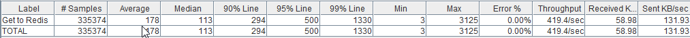
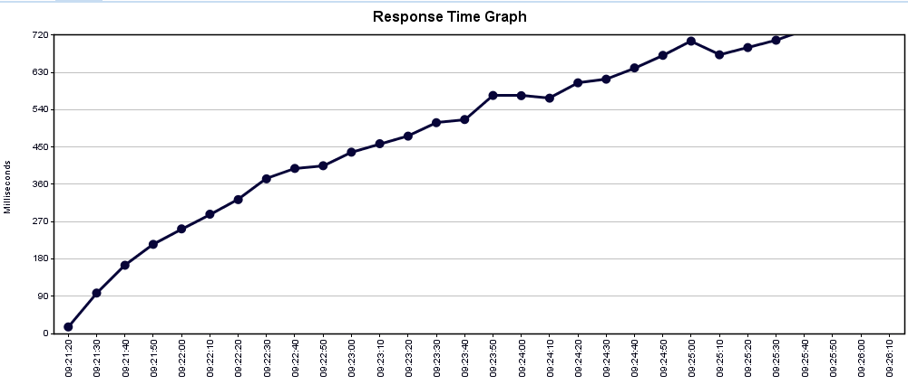
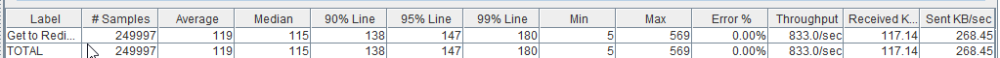
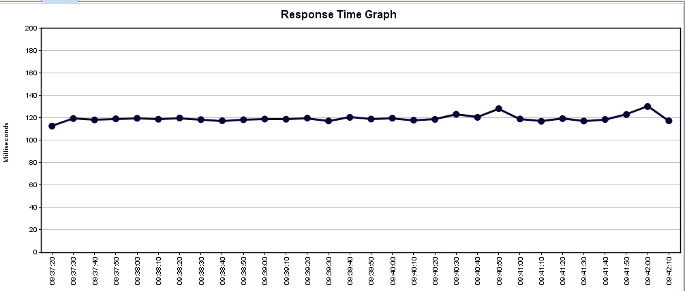
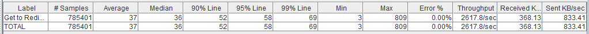
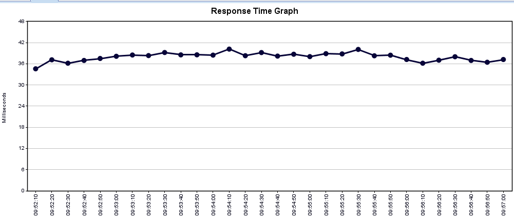

# Redis Performance Test

## Scenario
Use 100 concurrent request per second for about 300 seconds.
- Get redis key with sequential call
- Get redis key with parallel call
- Multi get redis key

## How to run
- run spring boot project using IDE / CMD using command `mvn spring-boot:run`
- import jmeter file from jmeter folder
- curl to save redis key to your local redis
- run which scenario you want from jmeter

## Result
- Get redis key with sequential call

- Get redis key with parallel call

- Multi Get redis key

